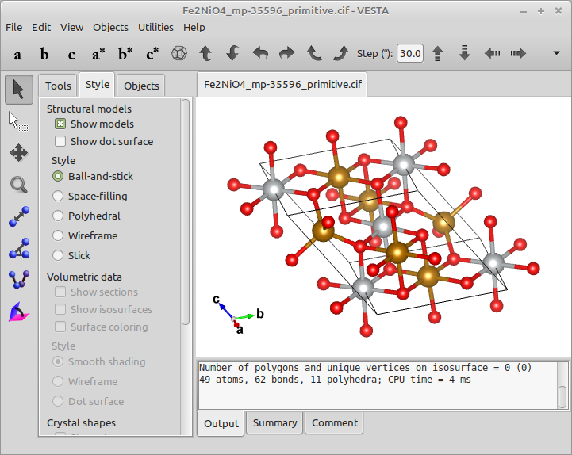
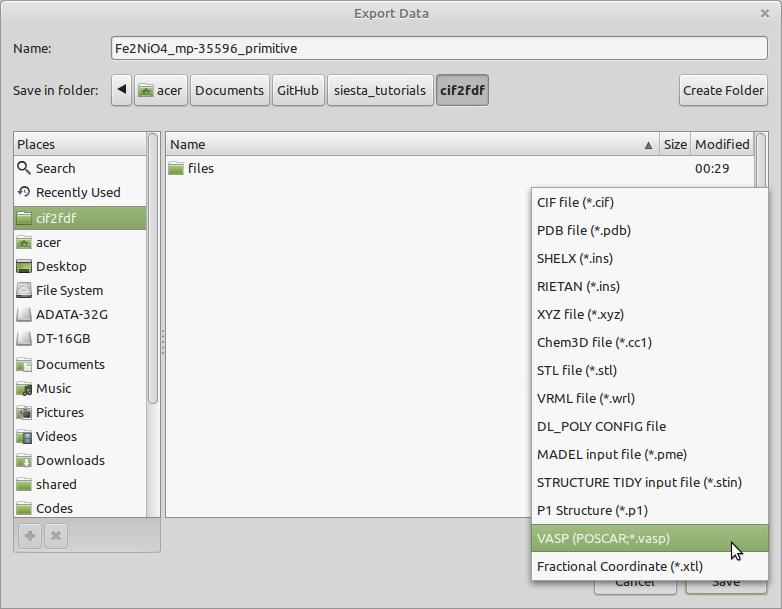
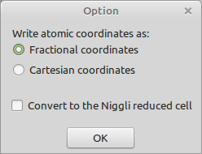
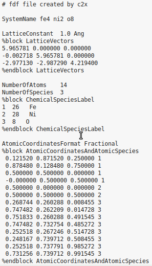

# Convert cif to fdf format (siesta input format)
I often had difficulty in converting my structure .cif files to siesta input format (.fdf). Recently, I found a utility code `c2x` that can help in this regard. Here, I want to show you in detail the steps that you should follow to correctly convert your .cif files to .fdf format.

## Requirements
### 1. VESTA: [Download](http://jp-minerals.org/vesta/en/download.html)
### 2. c2x: [Download](https://www.c2x.org.uk/downloads/)
The downloaded file is a binary executable, so just make it executable `chmod +x c2x`, and add it to your system PATH in ~/.bashrc with the following line:
```bash
export PATH="/path/to/c2x:$PATH"
```
Now you are able to run it with `c2x` command in a terminal.

## Step 1. Convert .cif to .POSCAR using VESTA
Here, I want to convert the [cif of the NiFe2O4 spinel ferrite](https://materialsproject.org/materials/mp-694944) to its siesta input .fdf file. First, open your cif with VESTA. 



Now export it to .POSCAR (vasp) format



A box appears where you can choode either fractional or cartesian coordinates. I choose "Fractional".



Now, change the extension of the created file (Fe2NiO4_mp-35596_primitive.vasp) from .vasp to .POSCAR (i.e. Fe2NiO4_mp-35596_primitive.POSCAR). The step is required for c2x code.
## Step 2. Convert .POSCAR to .fdf using `c2x`
Now open a terminal in the same directory of the generated .POSCAR file and convert the .POSCAR file to .fdf format:

```bash
$ c2x Fe2NiO4_mp-35596_primitive.POSCAR --fdf siesta.fdf
```
The siesta input .fdf file is created in the same directory, as follows:



It should be noted that the .fdf file does not contain other parameters and you should add them manually.
