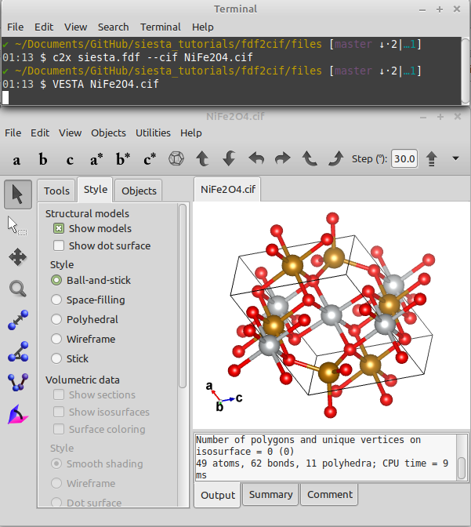

# Convert fdf (siesta input format) to cif format 
Those who have worked with SIESTA know that there is no easy way to visualize `.fdf` input format directly. Although there is already a software called [wxDragon](http://www.wxdragon.de/) that can visualize `.fdf` format directly, it shows errors in most cases. 
I have recently written a tutorial on [How to convert cif to fdf](../cif2fdf) using the `c2x` utility code. I just found that the code is also able to convert `.fdf` to `.cif`. In this way, one can easily visualize the generated `.cif` using VESTA. 

Here, I want to show you in detail the steps that you should follow to correctly convert your `.fdf` files to `.cif` format to visualize them.

## Requirements
### 1. VESTA: [Download](http://jp-minerals.org/vesta/en/download.html)
### 2. c2x: [Download](https://www.c2x.org.uk/downloads/)
The downloaded file is a binary executable, so just make it executable `chmod +x c2x`, and add it to your system PATH in ~/.bashrc with the following line:
```bash
export PATH="/path/to/c2x:$PATH"
```
Now you are able to run it with `c2x` command in a terminal.

## Convert `.fdf` to `.cif` using `c2x`
Here, I want to convert the [`.fdf` of NiFe2O4 spinel ferrite](files/siesta.fdf) to its `.cif`. A screenshot of the input `.fdf` file is given below: 


To convert it to `.cif`, open a terminal in the same directory of the `.fdf` file and run the following command:

```bash
$ c2x siesta.fdf --cif NiFe2O4.cif
```

Now the `NiFe2O4.cif` is created there and you can open it with VESTA


