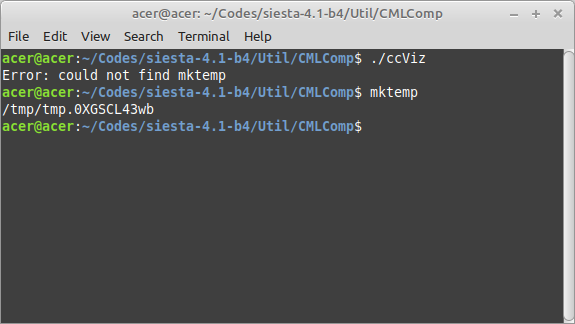
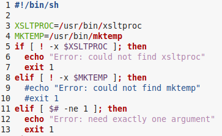
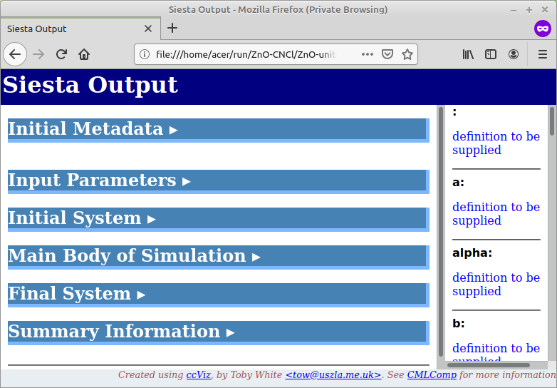

# How to run siests utility ccViz
There is a utility called `ccViz` in the `[siesta-root]/Util/CMLComp` directory, by which you can convert the `.xml` output generated by SIESTA to a relatively classified `.xhtml` format that can be displayed on web browsers like chrome or firefox.

**Note**: the `.xml` file is generated only if you perform your calculaton with the flag `XML.Write true` in your `.fdf` input.

However, due to the different ways that `mktemp` package works in old and newer versions of ubuntu, I could not run it. For example, if you run the utility in a terminal 
```bash
$ ./ccViz
```
it shows the error: `Error: could not find mktemp`. 



However as you see, mktemp is working without any problem. To resolve the error, just open the utility code `ccViz` in a text editor and comment out lines 9 and 10 with `#`. 



Now the utility code is able to work. You can add the directory to your system PATH in ~/.bashrc to run it everywhere. For example, if you open a terminal in your calculation directory and execute the following command: 

```bash
ccViz g-ZnO.xml
```

a file "g-ZnO.xhtml" is created there that you can open it with any web browser

